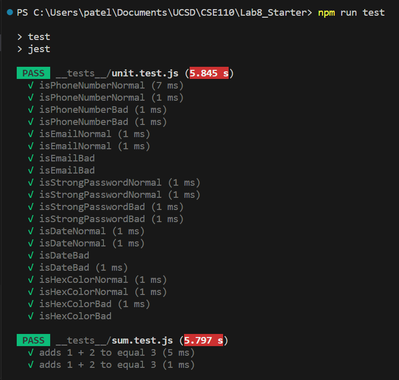
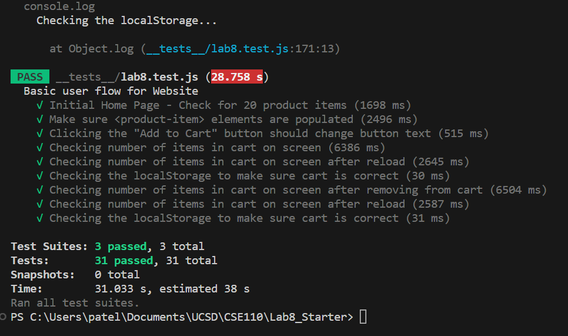

# Lab 8 - Starter
## Name: Khushi Patel

1. Automated tests would be with the GitHub Action because it would automatically run as an automated test every time code is pushed. If we manually want it to be run then we would go with option two of manually running the tests locally before pushing the code, however it would not be automated. Option three is also not viable because we should be testing incrementally throughout the development process and not just at the end.
2. No, E2E is to test the functionality of how an app works on a larger scale. To check if a function is returning the correct output, unit testing is more applicable. 
3. No, I would not use a unit test for message functionality since it is a big feature and not a single function. The unit test would not be enough to determine the interation between the individual components in this feature such as if the message was recieved, did the messsage recieved match the original, was the message sent, etc... I would rather use E2E testing in this case.
4. Yes, I would use a unit test for the max message length feature because it seems to be small and simple to test. It can be one function that checks the message before it's sent and determines the length of that message. It's a simple verification of if the message is 80 characters or less, or if the length is greater than 80.

## Test Results: 

